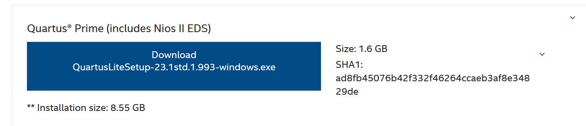
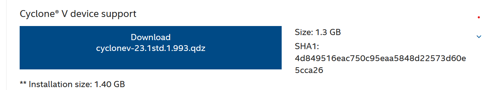
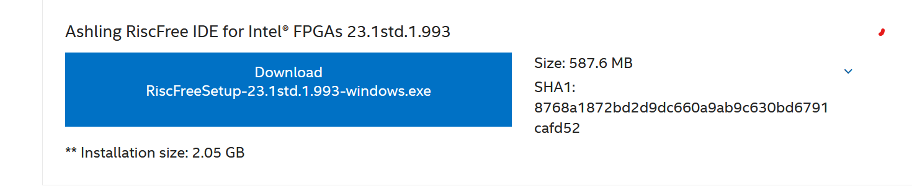
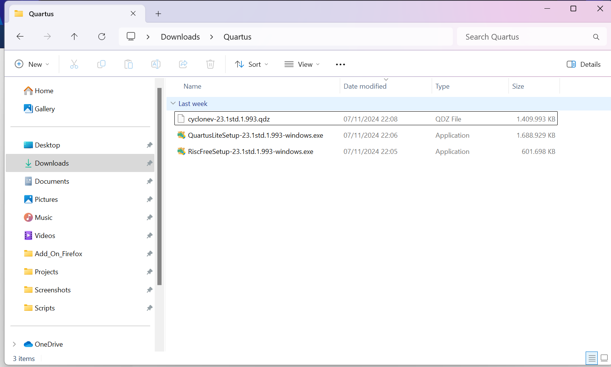
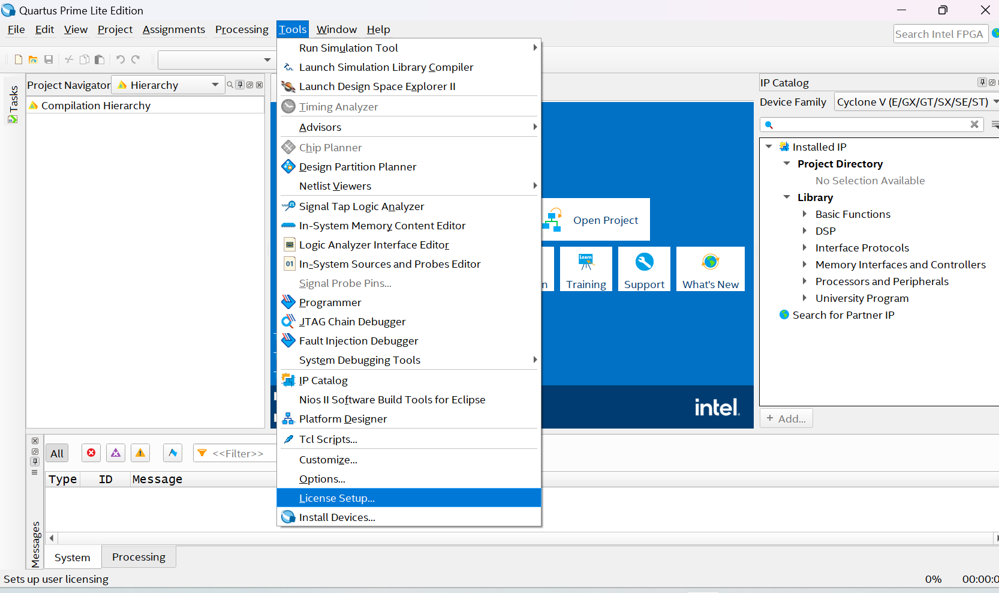
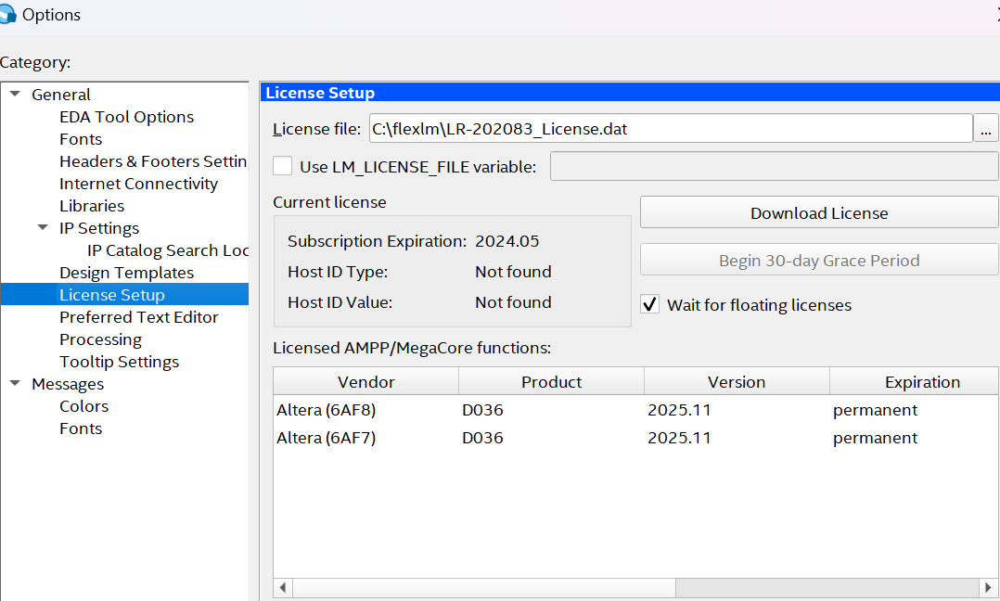
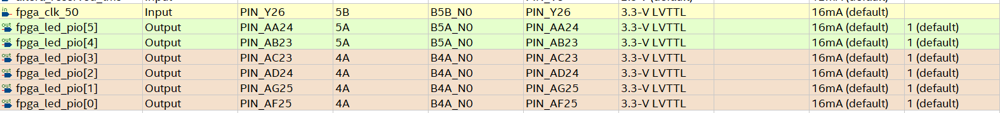

# Nios V FPGA Tutorial

In this tutorial, we will create and customize a soft processor with **Nios** (an embedded system with a processor and peripherals), embed it in the FPGA, and write code to control LEDs. This is a follow-up of the [Tutorial-FPGA-NIOS](https://insper.github.io/Embarcados-Avancados/Tutorial-FPGA-NIOS/).

## Getting Started

To follow this tutorial, you will need:

- **Hardware**: DE10-Standard and DE0-CV
- **Software**: Quartus 23.1std (23.1.1) or later and Ashling RiscFree IDE
- **OS**: Windows
- **Documents**:
  - [DE10-Standard_User_manual.pdf](./pdfs/DE10-Standard_User_manual.pdf)
  - [DE0_CV_User_Manual_v1.12.pdf](./pdfs/DE0_CV_User_Manual_v1.12.pdf)
  - [AN-784468-784469.pdf](./pdfs/an-784468-784469.pdf)

---

## Nios V

**Nios V** is a soft processor provided by Intel and integrated into Quartus. Based on a RISC-V architecture, Nios V supports the addition of custom instructions implemented in HDL. This makes it highly customizable.

---


## Comparison Nios V and Nios II


---
## Setting Up the Tools

To get started with the project, you’ll need to download and install a few essential tools. These include **Quartus 23.1std (or later)** and the **Ashling RiscFree IDE**, which will be used to compile and run the project, respectively.

### Step 1: Download

If Quartus is not yet installed on your system, begin by downloading the necessary files from the [Intel Website](https://www.intel.com/content/www/us/en/software-kit/825278/intel-quartus-prime-lite-edition-design-software-version-23-1-1-for-windows.html). Ensure you download the following files:

- **Quartus Download**: 
- **Cyclone V Download**: 
- **Ashling RiscFree IDE Download**: 

Once downloaded, place all files in the same folder, as shown below:

- **Image of files grouped together**: 

Now, run the `QuartusSetup.exe` file to initiate the installation process.

If Quartus is already installed, you should only download the **Ashling RiscFree IDE** and run the RiscFree executable to set it up as an external tool.

### Step 2: Downloading the License

Intel requires a license to use the Nios V IP in Quartus Prime Lite Edition. This license is essential to proceed with this project. Follow the instructions in the [License Nios V Guide](https://www.macnica.co.jp/en/business/semiconductor/articles/intel/140701/) to obtain the necessary license.

**Notes:**
- For this project, we will use the **Nios V/m IP**. Make sure to download this specific license.
- The license is valid for a period of one year and will expire afterward. You will need to renew it if you plan to continue using the Nios V IP beyond this period.


### Step 3: Setting up the License

Once you receive the `.dat` license file via email, download it and place it in the `flexlm` folder located in the root directory (e.g., `C:\flexlm`). If this folder does not exist, create it.

To configure Quartus to recognize the license, go to **Tools > License Setup** as shown in the image below:



In the License Setup window, add the path to the `.dat` file in the **License File** field. After completing these steps, your setup should resemble the following:



With everything now set up, you’re ready to begin working on the project.

---

## DE10-Standard

### Step 1: Creating The Project

In Quartus: **File ➡️ New Project Wizard**

1. **Directory, Name, Top-Level Entity**
   - Choose the destination as your repository.
   - Name the project as `niosv`.

2. **Project Type**
   - Select **Empty Project**.

3. **Add Files**
   - We won't add any files for now.

4. **Family, Device & Board Settings**
   - Look for the FPGA settings:
     - **Family**: Cyclone V
     - **Name**: 5CSXFC6D6F31C6

     

5. 🆗 **Finalize the Wizard**


### Step 2: Adding the Toplevel

First we need to create our toplevel and define our signals. In this project we will use a clock signal as Input and six LEDs as Output. 

### Step3: Adding the Toplevel File to the Project

To add a new file to the project, follow these steps:

1. Go to **File ➡️ New** or press `CTRL + N`.
2. Select **VHDL File**.
3. Save the file by navigating to **File ➡️ Save As**.
   - Name the file as `Nios_V_RTL.vhd`.
4. 🆗 Confirm to save the file.

Open the `Nios_V_RTL.vhd` file you created and add the following template code. This will serve as a starting point, allowing us to assign signals later on:

```vhdl
library IEEE;
use IEEE.std_logic_1164.all;

entity Nios_V_RTL is
    port (
        fpga_clk_50   : in  std_logic;
        fpga_led_pio  : out std_logic_vector(5 downto 0)
    );
end entity Nios_V_RTL;

architecture rtl of Nios_V_RTL is

begin

end rtl;
```

Right click the file and set it up as the Top Level Entity:

1. **Project ➡️ Set as Top-Level Entity**

### Step4: Assigning the I/Os

First, compile the project by running **Analysis & Synthesis** so that the Pin Planner can automatically recognize the I/Os, eliminating the need to set names manually.

1. Click on **Processing ➡️ Start ➡️ Start Analysis & Synthesis** or press `CTRL + K`.

To edit the pin assignments:

1. Go to **Assignments ➡️ Pin Planner**.

According to the [DE10-Standard User Manual](./pdfs/DE10-Standard_User_manual.pdf), your pin assignments should resemble the following configuration:



Lastly, you need to add a new file to the project that outlines the boundary conditions of the project for the tool.

To create a new constraints file, follow these steps:

1. Go to **File ➡️ New File ➡️ Synopsys Design Constraints File**.
2. Save the file as:

   ```plaintext
   Nios_V_RTL.sdc
    ```
3. File Template:
    ```plaintext
   # 50MHz board input clock
    create_clock -period 20 [get_ports fpga_clk_50]

    # Automatically apply a generate clock on the output of phase-locked loops (PLLs) 
    derive_pll_clocks

    ```


---


## Creating a Simple SoC

We will now create a basic SoC with the following components:

- A clock interface
- A memory (data and program storage)
- The **Nios V** processor
- A **PIO** peripheral (for managing digital outputs)
- A **JTAG-UART** for debugging via print statements

### Step-by-Step Guide

1. **Create a New Project**:
    - Copy the `Lab1_FPGA_RTL/` folder and rename it to `Lab2_FPGA_NIOS/`.
    - Open the project in Quartus from this new folder.

2. **Open Platform Designer**:
    - In Quartus, go to **Tools** > **Platform Designer**.

3. **Add Components**:
    - Add the following components with the specified configurations:
        - **On-Chip Memory (RAM or ROM Intel FPGA IP)**
            - Type: RAM
            - Memory size: 32768 bytes
        - **JTAG UART Intel FPGA IP**
            - Default settings
        - **PIO (Parallel I/O) Intel FPGA IP**
            - Width: 6
            - Direction: Output
        - **Nios V Processor**
            - Type: Nios V/e

---

## Connecting Clock and Reset

All peripherals need to be connected to the clock and reset signals. In Platform Designer, connect all clock and reset signals to the `clk` and `clk_rst` signals of the `clk_0` peripheral.

---

## Connecting the Bus

The main communication bus in Platform Designer is the Avalon bus, which is used to connect peripherals to the Nios V processor.

---

## Writing the LED Control Code

With the SoC created, let’s write a simple C program to control the LEDs:

```c
#include <stdio.h>
#include "system.h"
#include <alt_types.h>
#include <io.h> // For Avalon read/write functions

void delay(int n) {
    volatile unsigned int delay = 0;
    while (delay < n) {
        delay++;
    }
}

int main(void) {
    unsigned int led = 0;

    printf("Nios V Tutorial: LED Control\n");

    while (1) {
        if (led < PIO_0_DATA_WIDTH) { // Use the data width defined for the PIO
            IOWR_32DIRECT(PIO_0_BASE, 0, 0x01 << led++);
            usleep(50000); // 50 ms delay
        } else {
            led = 0; // Reset LED position after reaching the limit
        }
    }

    return 0;
}
