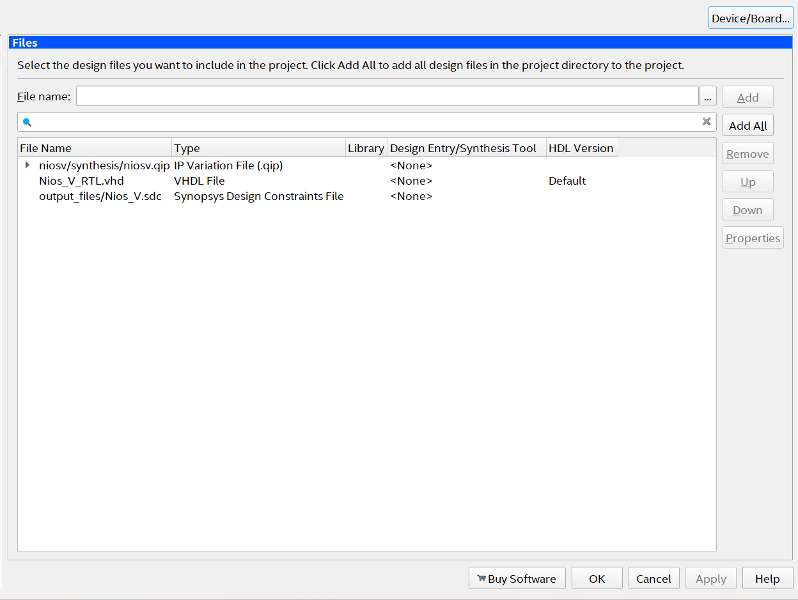

# Nios V FPGA Tutorial

In this tutorial, we will create and customize a soft processor with **Nios** (an embedded system with a processor and peripherals), embed it in the FPGA, and write code to control LEDs.

## Getting Started

To follow this tutorial, you will need:

- **Hardware**: DE10-Standard and DE0-CV
- **Software**: Quartus 23.1std (23.1.1) or later and Ashling RiscFree IDE
- **OS**: Windows
- **Documents**:
  - [DE10-Standard_User_manual.pdf](./pdfs/DE10-Standard_User_manual.pdf)
  - [DE0_CV_User_Manual_v1.12.pdf](./pdfs/DE0_CV_User_Manual_v1.12.pdf)
  - [AN-784468-784469.pdf](./pdfs/an-784468-784469.pdf)


## RISC

**Reduced Instruction Set Computer (RISC)** is a computer architecture based on the concept of simplifying instructions so that each performs only one function at a time. This model has the opposite idea of CISC(Complex Instruction Set Computer) which has a large set of complex instructions which makes it extremely versatile. RISC design aims to increase the speed of individual instructions by enabling the use of an instruction pipeline, allowing multiple instructions to be processed simultaneously at different stages of execution. By focusing on a smaller set of simple instructions, RISC reduces complexity and increases performance efficiency. Furthermore, most instructions are designed to execute in a single clock cycle, especially in pipelined architectures.


## RISC-V

**RISC-V** is an open and free instruction set architecture (ISA) based on RISC principles, designed for simplicity, flexibility, and scalability. Its modular design includes a minimal base instruction set with optional extensions, enabling customization for a wide range of applications, from embedded systems to high-performance computing. Unlike proprietary ISAs, RISC-V is open-source, fostering innovation and reducing development costs.

---

## Nios-V

**Nios-V** is a soft processor provided by Intel and integrated into Quartus. Based on a RISC-V architecture, Nios V supports the addition of custom instructions implemented in HDL. This makes it highly customizable.

---


## Comparison Nios V and Nios II

### 1. Instruction Set Architecture (ISA)
- **Nios II:**
  - *"Nios II is a 32-bit embedded processor architecture designed specifically for the Altera family of field-programmable gate array (FPGA) integrated circuits."*  
    ([Wikipedia - Nios II](https://en.wikipedia.org/wiki/Nios_II))

- **Nios V:**
  - *"The Nios V/m processor is a microcontroller core developed by Intel based on the RISC-V RV32IA instruction set..."*  
    ([Intel Documentation](https://cdrdv2-public.intel.com/679983/ug20343-683632-679983.pdf))

---

### 2. Customizability
- **Nios II:**
  - *"The soft-core nature of the Nios II processor lets the system designer specify and generate a custom Nios II core, tailored for his or her specific application requirements."*  
    ([Wikipedia - Nios II](https://en.wikipedia.org/wiki/Nios_II))

- **Nios V:**
  - *"The Nios V processor family is based upon the open-source RISC-V instruction set architecture (ISA), which provides a modular and extensible approach to processor design."*  
    ([Intel Technical Documentation](https://www.intel.com/programmable/technical-pdfs/726952.pdf))

---

### 3. Toolchain
- **Nios II:**
  - *"The Nios II EDS includes the following two closely-related software development tool flows: The Nios II SBT and The Nios II SBT for Eclipse. Both tools flows are based on the GNU C/C++ compiler."*  
    ([Intel Documentation](https://cdrdv2-public.intel.com/705142/n2sw_nii5v2gen2-17-0-683525-705142.pdf))

- **Nios V:**
  - *"The Nios V processor utilizes the open-source RISC-V GCC toolchain for software development, supported by Intel's Quartus Prime software for hardware integration."*  
    ([Intel Technical Documentation](https://www.intel.com/programmable/technical-pdfs/726952.pdf))

---

### 4. Performance
- **Nios II:**
  - *"Performance up to 250 DMIPS."*  
    ([Intel Documentation](https://www.intel.com/programmable/technical-pdfs/683620.pdf))

- **Nios V:**
  - *"The Nios V/m processor is designed to offer enhanced performance compared to its predecessors, leveraging the efficiencies of the RISC-V architecture."*  
    ([Intel Technical Documentation](https://www.intel.com/programmable/technical-pdfs/726952.pdf))

---

### 5. Ecosystem
- **Nios II:**
  - *"Development is hosted inside an Altera application called the Embedded Design Suite (EDS). The EDS contains a complete integrated development environment to manage both hardware and software..."*  
    ([Wikipedia - Nios II](https://en.wikipedia.org/wiki/Nios_II))

- **Nios V:**
  - *"The adoption of the RISC-V ISA allows Nios V to benefit from a growing ecosystem of open-source tools and software."*  
    ([Intel Technical Documentation](https://www.intel.com/programmable/technical-pdfs/726952.pdf))
    
---
## Setting Up the Tools

To get started with the project, you’ll need to download and install a few essential tools. These include **Quartus 23.1std (or later)** and the **Ashling RiscFree IDE**, which will be used to compile and run the project, respectively.

### Step 1: Download

If Quartus is not yet installed on your system, begin by downloading the necessary files from the [Intel Website](https://www.intel.com/content/www/us/en/software-kit/825278/intel-quartus-prime-lite-edition-design-software-version-23-1-1-for-windows.html). Ensure you download the following files:

- **Quartus Download**: 
- **Cyclone V Download**: 
- **Ashling RiscFree IDE Download**: 

Once downloaded, place all files in the same folder, as shown below:

- **Image of files grouped together**: 

Now, run the `QuartusSetup.exe` file to initiate the installation process.

If Quartus is already installed, you should only download the **Ashling RiscFree IDE** and run the RiscFree executable to set it up as an external tool.

### Step 2: Downloading the License

Intel requires a license to use the Nios V IP in Quartus Prime Lite Edition. This license is essential to proceed with this project. Follow the instructions in the [License Nios V Guide](https://www.macnica.co.jp/en/business/semiconductor/articles/intel/140701/) to obtain the necessary license.

**Notes:**
- For this project, we will use the **Nios V/m IP**. Make sure to download this specific license.
- The license is valid for a period of one year and will expire afterward. You will need to renew it if you plan to continue using the Nios V IP beyond this period.


### Step 3: Setting up the License

Once you receive the `.dat` license file via email, download it and place it in the `flexlm` folder located in the root directory (e.g., `C:\flexlm`). If this folder does not exist, create it.

To configure Quartus to recognize the license, go to **Tools > License Setup** as shown in the image below:


In the License Setup window, add the path to the `.dat` file in the **License File** field. After completing these steps, your setup should resemble the following:


With everything now set up, you’re ready to begin working on the project.

---

## DE10-Standard

This tutorial references both the [Tutorial FPGA RTL](https://insper.github.io/Embarcados-Avancados/Tutorial-FPGA-RTL/) and [Tutorial FPGA NIOS](https://insper.github.io/Embarcados-Avancados/Tutorial-FPGA-NIOS/). It’s recommended to go through these tutorials first, as they cover essential concepts like project creation, the Pin Planner, Platform Designer, and more.


### Step 1: Creating The Project

In Quartus: **File ➡️ New Project Wizard**

1. **Directory, Name, Top-Level Entity**
   - Choose the destination as your repository.
   - Name the project as `niosv`.

2. **Project Type**
   - Select **Empty Project**.

3. **Add Files**
   - We won't add any files for now.

4. **Family, Device & Board Settings**
   - Look for the FPGA settings:
     - **Family**: Cyclone V
     - **Name**: 5CSXFC6D6F31C6

     

5. 🆗 **Finalize the Wizard**

---


### Step 2: Adding the Toplevel

First we need to create our toplevel and define our signals. In this project we will use a clock signal as Input and six LEDs as Output. 

To add a new file to the project, follow these steps:

1. Go to **File ➡️ New** or press `CTRL + N`.
2. Select **VHDL File**.
3. Save the file by navigating to **File ➡️ Save As**.
   - Name the file as `Nios_V_RTL.vhd`.
4. 🆗 Confirm to save the file.

Open the `Nios_V_RTL.vhd` file you created and add the following template code. This will serve as a starting point, allowing us to assign signals later on:

```vhdl
library IEEE;
use IEEE.std_logic_1164.all;

entity Nios_V_RTL is
    port (
        fpga_clk_50   : in  std_logic;
        fpga_led_pio  : out std_logic_vector(5 downto 0)
    );
end entity Nios_V_RTL;

architecture rtl of Nios_V_RTL is

begin

end rtl;
```

Right click the file and set it up as the Top Level Entity:

1. **Project ➡️ Set as Top-Level Entity**

---

### Step3: Assigning the I/Os

First, compile the project by running **Analysis & Synthesis** so that the Pin Planner can automatically recognize the I/Os, eliminating the need to set names manually.

1. Click on **Processing ➡️ Start ➡️ Start Analysis & Synthesis** or press `CTRL + K`.

To edit the pin assignments:

1. Go to **Assignments ➡️ Pin Planner**.

According to the [DE10-Standard User Manual](./pdfs/DE10-Standard_User_manual.pdf), your pin assignments should resemble the following configuration:


Furthermore, you need to add a new file to the project that outlines the boundary conditions of the project for the tool, so that the clock is properly assigned.

To create a new constraints file, follow these steps:

1. Go to **File ➡️ New File ➡️ Synopsys Design Constraints File**.
2. Save the file as:

   ```plaintext
   Nios_V_RTL.sdc
    ```
3. File Template:
    ```plaintext
   # 50MHz board input clock
    create_clock -period 20 [get_ports fpga_clk_50]

    # Automatically apply a generate clock on the output of phase-locked loops (PLLs) 
    derive_pll_clocks

    ```

Lastly, click on **Processing ➡️ Start Compilation** or `CTRL + L` to compile the project so that the changes are applied. After compiling, you should observe that there are no longer any critical errors in the project.

---

### Step4: Platform Designer (PD)

We will now create a basic SoC with the following components:

- A clock interface
- A memory (data and program storage)
- The **Nios V** processor
- A **PIO** peripheral (for managing digital outputs)
- A **JTAG-UART** for debugging via print statements

#### Step-by-Step Guide

1. **Open Platform Designer**:
    - In Quartus, go to **Tools ➡️ Platform Designer**.

2. **Add Components**:
    - Add the following components with the specified configurations:
        - **On-Chip Memory (RAM or ROM Intel FPGA IP)**
            - Type: RAM
            - Memory size: 262144 bytes
        - **JTAG UART Intel FPGA IP**
            - Default settings
        - **PIO (Parallel I/O) Intel FPGA IP**
            - Width: 6
            - Direction: Output
        - **Nios V Processor**
            - Type: Nios V/m
            - Enable Debug and Enable Reset from Debug Module
            - Reset Agent: The On-Chip Memory added

3. **Make the Connections**:
    - Refer to the image below for the correct connections:
    

4. **Assign Base Addresses**:
    - There may still be some errors due to memory assignments. To resolve these, click on **System ➡️ Assign Base Addresses** to have the system automatically assign memory spaces without conflicts.
    - **Observation**:
        - The warnings and informational messages shown in the image below are expected and are not problematic.
        


5. **Save the File**:
    - **File ➡️ Save as** or `CTRL + S`
    - Name it `niosv.qsys`.

6. **Generate HDL**:
    - Click on Generate HDL for the PD to generate the project.
    - In`Create HDL Design Files For Synthesis` select `VHDL`

The platform designer part is done, so exit the PD windown to proceed.   

---

### Step5: Compiling the Project    

Before compiling the project, complete the following steps:

1. **Add the `niosv.qip` file to the project**:
    - Click on **Project ➡️ Add/Remove Files in Project...**  
      
    - Click on **Add ➡️ Add the `.qip` file ➡️ Apply**.  
      

2. **Add the NIOS-V to the `Nios_V_RTL.vhd` file**

    ```vhdl
    library IEEE;
    use IEEE.std_logic_1164.all;

    entity Nios_V_RTL is
        port (
            -- Gloabals
            fpga_clk_50   : in  std_logic;
            fpga_led_pio  : out std_logic_vector(5 downto 0)
    );
    end entity Nios_V_RTL;

    architecture rtl of Nios_V_RTL is

    component niosv is
            port (
                clk_clk       : in std_logic := 'X';
                reset_reset_n : in std_logic := 'X';
                    leds_export   : out std_logic_vector(5 downto 0)
            );
    end component niosv;

    begin

    u0 : component niosv
            port map (
                clk_clk       => fpga_clk_50,
                reset_reset_n => '1' ,
                leds_export   => fpga_led_pio
                    
            );

    end rtl;
    ```


